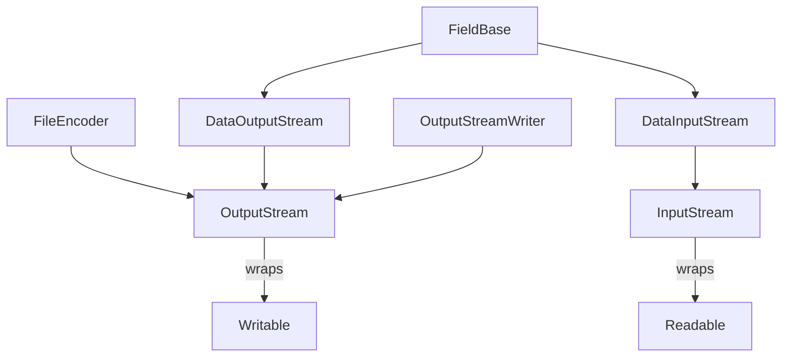

# fit-typescript-sdk

This project aims to provide a TypeScript implementation of the [Garmin FIT protocol](https://developer.garmin.com/fit/protocol/). The current code base only contains a handful of utility classes and a partial `FileEncoder`. Below is a roadmap describing every task required to reach a publishable SDK.

## Status Overview
- [x] Basic utilities (`CRC16`, `Fit`, `ProtocolVersion`)
- [x] Basic `FileEncoder` skeleton
- [ ] `FileDecoder` implementation
- [x] Streaming classes (`InputStream`, `OutputStream`, `DataInputStream`, `DataOutputStream`, `OutputStreamWriter`)
- [ ] Numeric helpers (`BigInteger`, `BigDecimal`)
- [ ] Field helpers (`FieldComponent`, `DeveloperField`, `DeveloperFieldDefinition`, `DeveloperDataIdMesg`)
- [ ] Complete message class implementations (see list below)
- [ ] Tests for each component
- [ ] Continuous integration & npm packaging

## Missing Classes
The repository currently lacks many classes required by the FIT specification. Below is an exhaustive list extracted from the protocol documentation and code references.

### Core Helpers
- `FileDecoder`
- `BigInteger`
- `BigDecimal`
- `FieldComponent`
- `DeveloperField`
- `DeveloperDataIdMesg`
- `FitBaseType`
- `FitBaseUnit`

### Message Types
The following FIT messages require dedicated classes. None of them are present in the repository at the moment:
- [ ] FileIdMesg
- [ ] CapabilitiesMesg
- [ ] DeviceSettingsMesg
- [ ] UserProfileMesg
- [ ] HrmProfileMesg
- [ ] SdmProfileMesg
- [ ] BikeProfileMesg
- [ ] ZonesTargetMesg
- [ ] HrZoneMesg
- [ ] PowerZoneMesg
- [ ] MetZoneMesg
- [ ] SportMesg
- [ ] GoalMesg
- [ ] SessionMesg
- [ ] LapMesg
- [ ] RecordMesg
- [ ] EventMesg
- [ ] DeviceInfoMesg
- [ ] WorkoutMesg
- [ ] WorkoutStepMesg
- [ ] ScheduleMesg
- [ ] WeightScaleMesg
- [ ] CourseMesg
- [ ] CoursePointMesg
- [ ] TotalsMesg
- [ ] ActivityMesg
- [ ] SoftwareMesg
- [ ] FileCapabilitiesMesg
- [ ] MesgCapabilitiesMesg
- [ ] FieldCapabilitiesMesg
- [ ] FileCreatorMesg
- [ ] BloodPressureMesg
- [ ] SpeedZoneMesg
- [ ] MonitoringMesg
- [ ] TrainingFileMesg
- [ ] HrvMesg
- [ ] AntRxMesg
- [ ] AntTxMesg
- [ ] AntChannelIdMesg
- [ ] LengthMesg
- [ ] MonitoringInfoMesg
- [ ] PadMesg
- [ ] SlaveDeviceMesg
- [ ] ConnectivityMesg
- [ ] WeatherConditionsMesg
- [ ] WeatherAlertMesg
- [ ] CadenceZoneMesg
- [ ] HrMesg
- [ ] SegmentLapMesg
- [ ] MemoGlobMesg
- [ ] SegmentIdMesg
- [ ] SegmentLeaderboardEntryMesg
- [ ] SegmentPointMesg
- [ ] SegmentFileMesg
- [ ] WorkoutSessionMesg
- [ ] WatchfaceSettingsMesg
- [ ] GpsMetadataMesg
- [ ] CameraEventMesg
- [ ] TimestampCorrelationMesg
- [ ] GyroscopeDataMesg
- [ ] AccelerometerDataMesg
- [ ] ThreeDSensorCalibrationMesg
- [ ] VideoFrameMesg
- [ ] ObdiiDataMesg
- [ ] NmeaSentenceMesg
- [ ] AviationAttitudeMesg
- [ ] VideoMesg
- [ ] VideoTitleMesg
- [ ] VideoDescriptionMesg
- [ ] VideoClipMesg
- [ ] OhrSettingsMesg
- [ ] ExdScreenConfigurationMesg
- [ ] ExdDataFieldConfigurationMesg
- [ ] ExdDataConceptConfigurationMesg
- [ ] FieldDescriptionMesg
- [ ] DeveloperDataIdMesg
- [ ] MagnetometerDataMesg
- [ ] BarometerDataMesg
- [ ] OneDSensorCalibrationMesg
- [ ] MonitoringHrDataMesg
- [ ] TimeInZoneMesg
- [ ] SetMesg
- [ ] StressLevelMesg
- [ ] MaxMetDataMesg
- [ ] DiveSettingsMesg
- [ ] DiveGasMesg
- [ ] DiveAlarmMesg
- [ ] ExerciseTitleMesg
- [ ] DiveSummaryMesg
- [ ] SleepLevelMesg
- [ ] JumpMesg
- [ ] BeatIntervalsMesg
- [ ] RespirationRateMesg
- [ ] SplitMesg
- [ ] ClimbProMesg
- [ ] TankUpdateMesg
- [ ] TankSummaryMesg
- [ ] SleepAssessmentMesg
- [ ] HrvStatusSummaryMesg
- [ ] HrvValueMesg
- [ ] DeviceAuxBatteryInfoMesg
- [ ] DiveApneaAlarmMesg
- [ ] MfgRangeMinMesg
- [ ] MfgRangeMaxMesg

## Roadmap
Each item below describes a self-contained Codex task. When all boxes are checked, the SDK can be published to npm.

1. **Stream Abstractions**
   - [x] Implement `InputStream` and `OutputStream` wrappers using Node streams.
   - [x] Implement `DataInputStream`, `DataOutputStream` and `OutputStreamWriter` helpers.
   - [ ] Integrate `BigInteger` and `BigDecimal` utilities for large numeric values.
2. **File Handling**
   - [x] Write basic `FileEncoder` (already present).
   - [ ] Finish `FileEncoder` (record CRC during writes, manage message definitions).
   - [ ] Create `FileDecoder` able to parse FIT headers and message records.
3. **Field and Message Structure**
   - [x] Base `Field`, `SubField` and definition classes.
   - [ ] Add `FieldComponent` logic.
   - [ ] Add `DeveloperField` and `DeveloperFieldDefinition` with support for `DeveloperDataIdMesg`.
4. **Message Classes**
   - [ ] Implement each message type listed above under *Message Types*.
   - [ ] Populate `Factory` with a `mesgs` array describing field layouts for every message.
5. **Profile Information**
   - [ ] Add enums (`FitBaseType`, `FitBaseUnit`, `Profile.Type` or equivalent) following the FIT profile.
   - [ ] Provide helpers to access profile version and message numbers.
6. **Testing and Validation**
   - [ ] Unit tests for `FileEncoder` and `FileDecoder`.
   - [ ] Unit tests for every message class (creation, encoding, decoding).
   - [ ] Protocol validation via `ProtocolValidator` against all versions.
7. **Continuous Integration**
   - [ ] Set up GitHub Actions to run `npm test` and TypeScript build on each pull request.
   - [ ] Enforce linting and code formatting.
8. **Packaging**
   - [ ] Generate `dist/` with compiled JavaScript and type declarations.
 - [ ] Publish the package to npm with semantic versioning.

## Architecture Overview

## How to Contribute
Contributions are welcome. Each unchecked item in the roadmap can be tackled as a standalone pull request. Please include unit tests for new functionality and keep code style consistent with the existing files.

