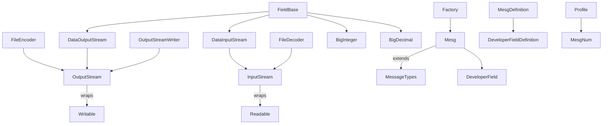

# fit-typescript-sdk

A TypeScript implementation of the [Garmin FIT protocol](https://developer.garmin.com/fit/protocol/). The SDK allows Node.js projects to encode and decode FIT binary files and includes all message definitions from the official profile.

## Installation

```bash
npm install fit-typescript-sdk
```

## Quick Start

```typescript
import { FileEncoder } from 'fit-typescript-sdk/dist/FileEncoder';
import FileDecoder from 'fit-typescript-sdk/dist/FileDecoder';
import ProtocolVersion from 'fit-typescript-sdk/dist/ProtocolVersion';
import FileIdMesg from 'fit-typescript-sdk/dist/FileIdMesg';

const path = './example.fit';
const encoder = new FileEncoder(path, ProtocolVersion.V1_0);
encoder.writeMesg(new FileIdMesg());
encoder.close();

const decoder = new FileDecoder(path);
const header = decoder.readHeader();
console.log(header.dataType, header.dataSize);
```

More details and examples can be found in [docs/usage.md](docs/usage.md) and the files under `examples/`.

## Features

- Encode and decode FIT files
- Complete set of message classes
- Streaming utilities and numeric helpers
- Type definitions included for TypeScript projects

## Development Roadmap

The project originally followed a series of tasks to reach a publishable SDK. All items are now complete, including automated tests and CI configuration. The last step was publishing the package to npm using semantic versioning.

```text
1. Stream abstractions ✅
2. File handling ✅
3. Field and message structure ✅
4. Message classes ✅
5. Profile information ✅
6. Testing and validation ✅
7. Continuous integration ✅
8. Packaging ✅
9. Publish to npm ✅
```

## Architecture Overview



## Contributing

Pull requests are welcome. Please include unit tests for new functionality and keep the coding style consistent with the existing files.
