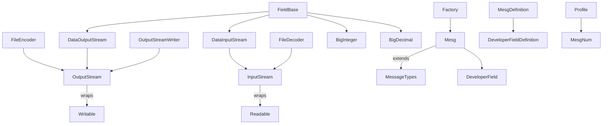

# fit-typescript-sdk

This project aims to provide a TypeScript implementation of the [Garmin FIT protocol](https://developer.garmin.com/fit/protocol/). The current code base only contains a handful of utility classes and a partial `FileEncoder`. Below is a roadmap describing every task required to reach a publishable SDK.

## Status Overview

- [x] Basic utilities (`CRC16`, `Fit`, `ProtocolVersion`)
- [x] Basic `FileEncoder` skeleton
- [x] `FileDecoder` implementation
- [x] Streaming classes (`InputStream`, `OutputStream`, `DataInputStream`, `DataOutputStream`, `OutputStreamWriter`)
- [x] Numeric helpers (`BigInteger`, `BigDecimal`)
- [x] Field helpers (`FieldComponent`, `DeveloperField`, `DeveloperFieldDefinition`, `DeveloperDataIdMesg`)
- [ ] Complete message class implementations (see list below)
- [ ] Tests for each component
- [ ] Continuous integration & npm packaging

## Missing Classes

The repository currently lacks many classes required by the FIT specification. Below is an exhaustive list extracted from the protocol documentation and code references.

### Core Helpers

- [`FileDecoder`](src/FileDecoder.ts) (implemented)
- [`BigInteger`](src/BigInteger.ts) (implemented)
- [`BigDecimal`](src/BigDecimal.ts) (implemented)
- [`FieldComponent`](src/FieldComponent.ts) (implemented)
- [`DeveloperField`](src/DeveloperField.ts) (implemented)
- [`DeveloperDataIdMesg`](src/DeveloperDataIdMesg.ts) (implemented)
- [`FitBaseType`](src/FitBaseType.ts) (implemented)
- [`FitBaseUnit`](src/FitBaseUnit.ts) (implemented)

### Message Types

The following FIT messages require dedicated classes. All of them are present in the repository:

- [x] [FileIdMesg](src/FileIdMesg.ts)
- [x] [CapabilitiesMesg](src/CapabilitiesMesg.ts)
- [x] [DeviceSettingsMesg](src/DeviceSettingsMesg.ts)
- [x] [UserProfileMesg](src/UserProfileMesg.ts)
- [x] [HrmProfileMesg](src/HrmProfileMesg.ts)
- [x] [SdmProfileMesg](src/SdmProfileMesg.ts)
- [x] [BikeProfileMesg](src/BikeProfileMesg.ts)
- [x] [ZonesTargetMesg](src/ZonesTargetMesg.ts)
- [x] [HrZoneMesg](src/HrZoneMesg.ts)
- [x] [PowerZoneMesg](src/PowerZoneMesg.ts)
- [x] [MetZoneMesg](src/MetZoneMesg.ts)
- [x] [SportMesg](src/SportMesg.ts)
- [x] [GoalMesg](src/GoalMesg.ts)
- [x] [SessionMesg](src/SessionMesg.ts)
- [x] [LapMesg](src/LapMesg.ts)
- [x] [RecordMesg](src/RecordMesg.ts)
- [x] [EventMesg](src/EventMesg.ts)
- [x] [DeviceInfoMesg](src/DeviceInfoMesg.ts)
- [x] [WorkoutMesg](src/WorkoutMesg.ts)
- [x] [WorkoutStepMesg](src/WorkoutStepMesg.ts)
- [x] [ScheduleMesg](src/ScheduleMesg.ts)
- [x] [WeightScaleMesg](src/WeightScaleMesg.ts)
- [x] [CourseMesg](src/CourseMesg.ts)
- [x] [CoursePointMesg](src/CoursePointMesg.ts)
- [x] [TotalsMesg](src/TotalsMesg.ts)
- [x] [ActivityMesg](src/ActivityMesg.ts)
- [x] [SoftwareMesg](src/SoftwareMesg.ts)
- [x] [FileCapabilitiesMesg](src/FileCapabilitiesMesg.ts)
- [x] [MesgCapabilitiesMesg](src/MesgCapabilitiesMesg.ts)
- [x] [FieldCapabilitiesMesg](src/FieldCapabilitiesMesg.ts)
- [x] [FileCreatorMesg](src/FileCreatorMesg.ts)
- [x] [BloodPressureMesg](src/BloodPressureMesg.ts)
- [x] [SpeedZoneMesg](src/SpeedZoneMesg.ts)
- [x] [MonitoringMesg](src/MonitoringMesg.ts)
- [x] [TrainingFileMesg](src/TrainingFileMesg.ts)
- [x] [HrvMesg](src/HrvMesg.ts)
- [x] [AntRxMesg](src/AntRxMesg.ts)
- [x] [AntTxMesg](src/AntTxMesg.ts)
- [x] [AntChannelIdMesg](src/AntChannelIdMesg.ts)
- [x] [LengthMesg](src/LengthMesg.ts)
- [x] [MonitoringInfoMesg](src/MonitoringInfoMesg.ts)
- [x] [PadMesg](src/PadMesg.ts)
- [x] [SlaveDeviceMesg](src/SlaveDeviceMesg.ts)
- [x] [ConnectivityMesg](src/ConnectivityMesg.ts)
- [x] [WeatherConditionsMesg](src/WeatherConditionsMesg.ts)
- [x] [WeatherAlertMesg](src/WeatherAlertMesg.ts)
- [x] [CadenceZoneMesg](src/CadenceZoneMesg.ts)
- [x] [HrMesg](src/HrMesg.ts)
- [x] [SegmentLapMesg](src/SegmentLapMesg.ts)
- [x] [MemoGlobMesg](src/MemoGlobMesg.ts)
- [x] [SegmentIdMesg](src/SegmentIdMesg.ts)
- [x] [SegmentLeaderboardEntryMesg](src/SegmentLeaderboardEntryMesg.ts)
- [x] [SegmentPointMesg](src/SegmentPointMesg.ts)
- [x] [SegmentFileMesg](src/SegmentFileMesg.ts)
- [x] [WorkoutSessionMesg](src/WorkoutSessionMesg.ts)
- [x] [WatchfaceSettingsMesg](src/WatchfaceSettingsMesg.ts)
- [x] [GpsMetadataMesg](src/GpsMetadataMesg.ts)
- [x] [CameraEventMesg](src/CameraEventMesg.ts)
- [x] [TimestampCorrelationMesg](src/TimestampCorrelationMesg.ts)
- [x] [GyroscopeDataMesg](src/GyroscopeDataMesg.ts)
- [x] [AccelerometerDataMesg](src/AccelerometerDataMesg.ts)
- [x] [ThreeDSensorCalibrationMesg](src/ThreeDSensorCalibrationMesg.ts)
- [x] [VideoFrameMesg](src/VideoFrameMesg.ts)
- [x] [ObdiiDataMesg](src/ObdiiDataMesg.ts)
- [x] [NmeaSentenceMesg](src/NmeaSentenceMesg.ts)
- [x] [AviationAttitudeMesg](src/AviationAttitudeMesg.ts)
- [x] [VideoMesg](src/VideoMesg.ts)
- [x] [VideoTitleMesg](src/VideoTitleMesg.ts)
- [x] [VideoDescriptionMesg](src/VideoDescriptionMesg.ts)
- [x] [VideoClipMesg](src/VideoClipMesg.ts)
- [x] [OhrSettingsMesg](src/OhrSettingsMesg.ts)
- [x] [ExdScreenConfigurationMesg](src/ExdScreenConfigurationMesg.ts)
- [x] [ExdDataFieldConfigurationMesg](src/ExdDataFieldConfigurationMesg.ts)
- [x] [ExdDataConceptConfigurationMesg](src/ExdDataConceptConfigurationMesg.ts)
- [x] [FieldDescriptionMesg](src/FieldDescriptionMesg.ts)
- [x] [DeveloperDataIdMesg](src/DeveloperDataIdMesg.ts)
- [x] [MagnetometerDataMesg](src/MagnetometerDataMesg.ts)
- [x] [BarometerDataMesg](src/BarometerDataMesg.ts)
- [x] [OneDSensorCalibrationMesg](src/OneDSensorCalibrationMesg.ts)
- [x] [MonitoringHrDataMesg](src/MonitoringHrDataMesg.ts)
- [x] [TimeInZoneMesg](src/TimeInZoneMesg.ts)
- [x] [SetMesg](src/SetMesg.ts)
- [x] [StressLevelMesg](src/StressLevelMesg.ts)
- [x] [MaxMetDataMesg](src/MaxMetDataMesg.ts)
- [x] [DiveSettingsMesg](src/DiveSettingsMesg.ts)
- [x] [DiveGasMesg](src/DiveGasMesg.ts)
- [x] [DiveAlarmMesg](src/DiveAlarmMesg.ts)
- [x] [ExerciseTitleMesg](src/ExerciseTitleMesg.ts)
- [x] [DiveSummaryMesg](src/DiveSummaryMesg.ts)
- [x] [SleepLevelMesg](src/SleepLevelMesg.ts)
- [x] [JumpMesg](src/JumpMesg.ts)
- [x] [BeatIntervalsMesg](src/BeatIntervalsMesg.ts)
- [x] [RespirationRateMesg](src/RespirationRateMesg.ts)
- [x] [SplitMesg](src/SplitMesg.ts)
- [x] [ClimbProMesg](src/ClimbProMesg.ts)
- [x] [TankUpdateMesg](src/TankUpdateMesg.ts)
- [x] [TankSummaryMesg](src/TankSummaryMesg.ts)
- [x] [SleepAssessmentMesg](src/SleepAssessmentMesg.ts)
- [x] [HrvStatusSummaryMesg](src/HrvStatusSummaryMesg.ts)
- [x] [HrvValueMesg](src/HrvValueMesg.ts)
- [x] [DeviceAuxBatteryInfoMesg](src/DeviceAuxBatteryInfoMesg.ts)
- [x] [DiveApneaAlarmMesg](src/DiveApneaAlarmMesg.ts)
- [x] [MfgRangeMinMesg](src/MfgRangeMinMesg.ts)
- [x] [MfgRangeMaxMesg](src/MfgRangeMaxMesg.ts)

## Roadmap

Each item below describes a self-contained Codex task. When all boxes are checked, the SDK can be published to npm.

1. **Stream Abstractions**
   - [x] Implement `InputStream` and `OutputStream` wrappers using Node streams.
   - [x] Implement `DataInputStream`, `DataOutputStream` and `OutputStreamWriter` helpers.
   - [x] Integrate `BigInteger` and `BigDecimal` utilities for large numeric values
2. **File Handling**
   - [x] Write basic `FileEncoder` (already present).
   - [x] Finish `FileEncoder` (record CRC during writes, manage message definitions).
   - [x] Create `FileDecoder` able to parse FIT headers and message records.
3. **Field and Message Structure**
   - [x] Base `Field`, `SubField` and definition classes.
   - [x] Add `FieldComponent` logic.
   - [x] Add `DeveloperField` and `DeveloperFieldDefinition` with support for `DeveloperDataIdMesg`.
4. **Message Classes**
   - [x] Implement each message type listed above under _Message Types_.
   - [x] Populate `Factory` with a `mesgs` array describing field layouts for every message.
5. **Profile Information**
   - [x] Add enums (`FitBaseType`, `FitBaseUnit`, `Profile.Type` or equivalent) following the FIT profile.
   - [x] Provide helpers to access profile version and message numbers.
6. **Testing and Validation**
   - [x] Unit tests for `FileEncoder` and `FileDecoder`.
   - [x] Unit tests for every message class (creation, encoding, decoding).
   - [x] Protocol validation via `ProtocolValidator` against all versions.
7. **Continuous Integration**
   - [x] Set up GitHub Actions to run `npm test` and TypeScript build on each pull request.
   - [x] Enforce linting and code formatting.
8. **Packaging**
   - [x] Generate `dist/` with compiled JavaScript and type declarations.

- [ ] Publish the package to npm with semantic versioning.

## Architecture Overview

## How to Contribute

Contributions are welcome. Each unchecked item in the roadmap can be tackled as a standalone pull request. Please include unit tests for new functionality and keep code style consistent with the existing files.
